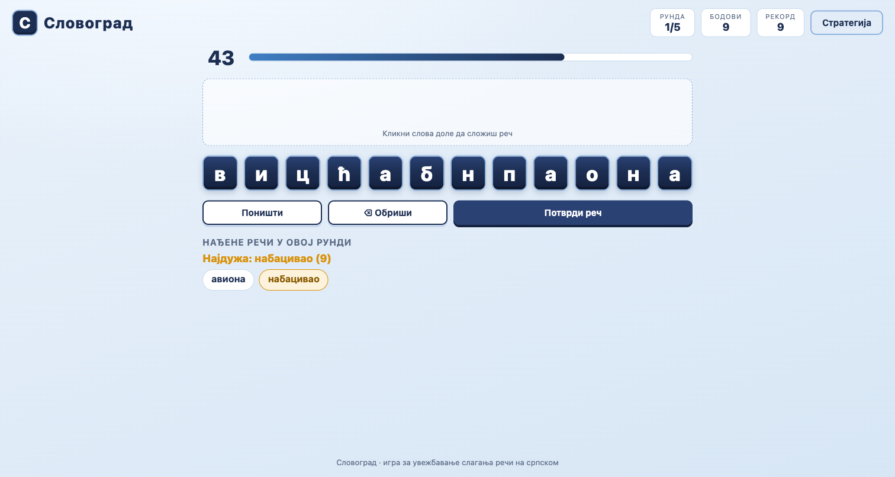
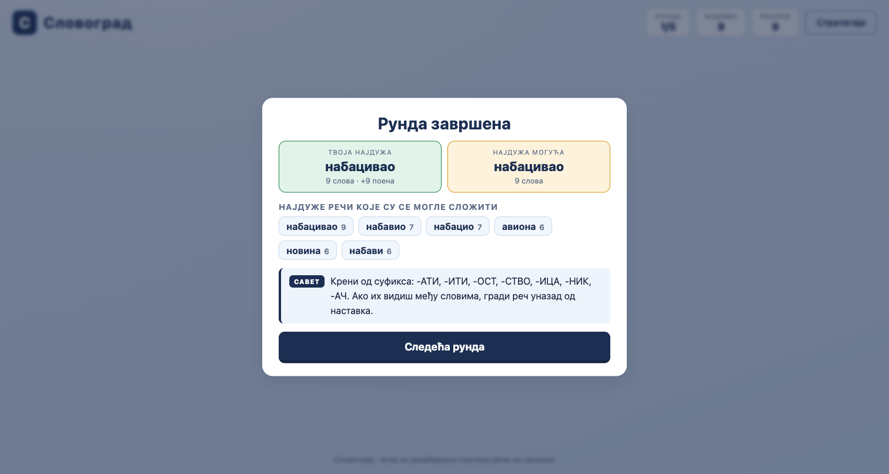

# Словоград

Игра за увежбавање слагања **најдуже речи из понуђених слова** на српском језику (ћирилица), инспирисана словном игром из ТВ квизова.




## Како се игра

- **5 рунди** — у свакој добијеш **12 слова** и време за слагање (**подесиво 30–120с, подразумевано 60с**).
- Кликаш слова (или куцаш на тастатури) да сложиш реч, па је потврдиш (`Enter` или дугме).
- Реч мора постојати у речнику и имати бар 3 слова.
- Бодова: колико слова — толико поена. Реч од свих 12 слова доноси **бонус +3**.
- После сваке рунде видиш **најдуже речи које су се могле сложити** и добијеш **савет** како да размишљаш.
- На крају игре добијеш **закључке**: колико потенцијала слова си искористио, које дуге речи су ти промакле и шта да вежбаш следећи пут.

Циљ није само поен — него да научиш да *видиш* дуге речи у насумичним словима.

## Покретање

Нема build корака — обичан HTML/CSS/JS:

```bash
# било који статички сервер, нпр:
python3 -m http.server 8080
# па отвори http://localhost:8080
```

Или играй онлајн: **https://acailic.github.io/slovograd/**

## Речник

~60.000 речи у ћирилици, из [OpenSubtitles frequency листе за српски](https://github.com/hermitdave/FrequencyWords) (2018). Листе су мешовите (latinica + ћирилица), па се latinica транслитерује и филтрира (учесталост ≥ 8, дужина 3–12, само српска ћирилична азбука).

Освежавање речника:

```bash
curl -L -o data/sr_full.txt https://raw.githubusercontent.com/hermitdave/FrequencyWords/master/content/2018/sr/sr_full.txt
node scripts/build-words.mjs data/sr_full.txt
```

## Како игра "мисли" (за радознале)

- Слова нису чисто насумична: свака рунда се гради око **скривене речи семена** (8–10 слова из учесталих речи), па се додају пондерисана допунска слова — тако увек постоји дуго решење.
- На почетку рунде игра израчуна **све речи** које се могу сложити из тих слова, па на крају рунде приказује најдуже.
- Савети и закључци се ротирају / персонализују по твом искоришћењу потенцијала.

## Технологија

Обичан vanilla JS без зависности и без build-а. Рекорд се чува у `localStorage`.

## Лиценца

MIT — види [LICENSE](LICENSE).
